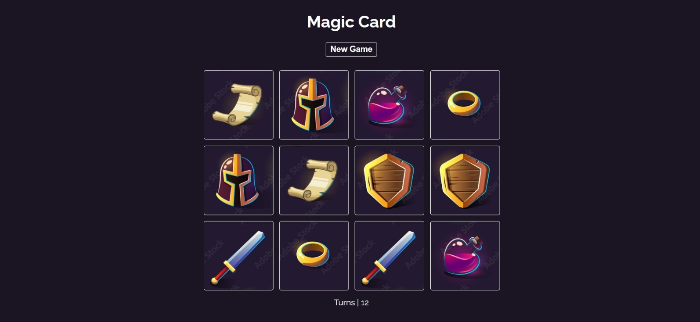
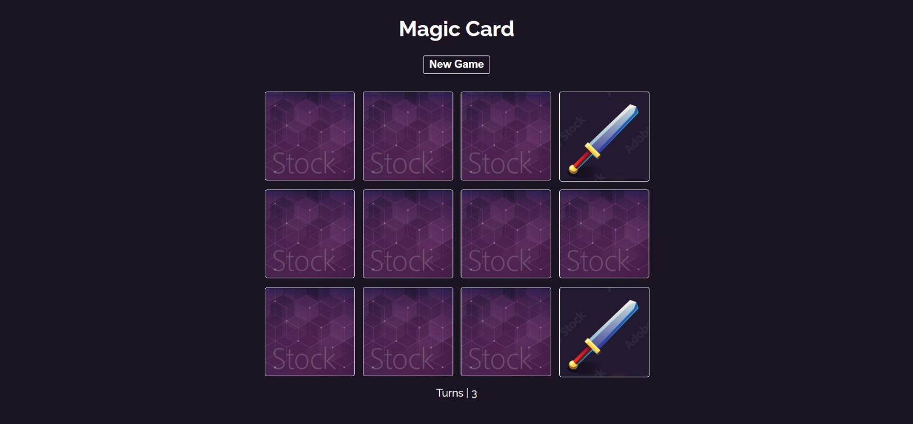
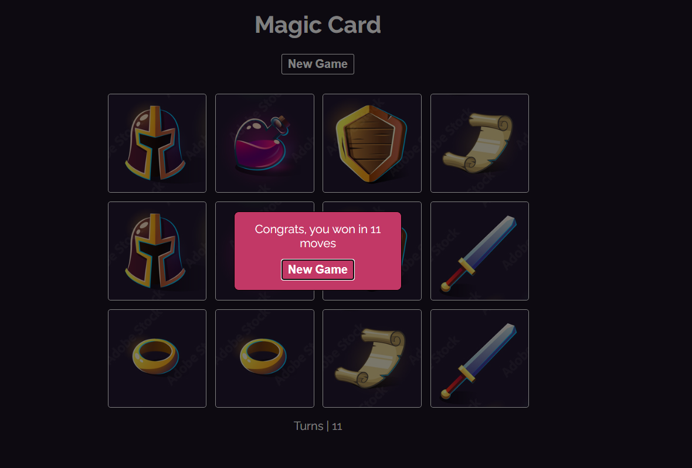

<h2>MAGIC CARD</h2>

It is a 4x3 card matching game. The purpose is to find the matching cards in one minute. You have to be quick, you lose otherwise.

Key Points;

<ul>
  <li>Responsive design</li>
  <li>Shuffles cards before new game</li>
</ul>

You can visit https://tarikkoc-magic-card.netlify.app/

<h2>USAGE</h2>

1. Fork the repo and then clone it or download it.

2.First install all dependencies:

  <storng>npm install</storng> (with npm)  
  <storng>yarn</storng> (or with yarn)

  
3. Start the server

npm start [OR] yarn start

  

4. Now run the app

localhost:[PORT]

  

 

 

